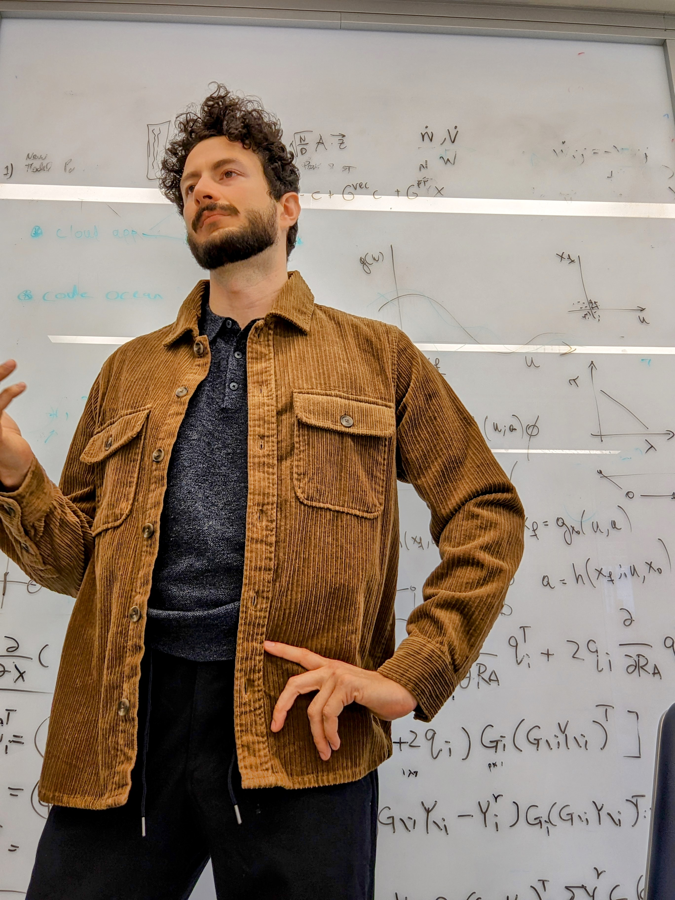

Mauro is currently a postdoctoral research scientist in the Center for Theoretical Neuroscience at Columbia University in the city of New York. He completed his undergraduate studies in physics and mathematics at the National University of Colombia and holds a master's degree in Theoretical and Mathematical Physics and a Ph.D. in Computational Neuroscience from the University of Munich in Germany.

Mauro combines analytical methods from mathematical physics and computational approaches from machine learning to explain diverse phenomena in neuroscience. His contributions include in-depth analyses of neural network models of different brain systems, from the brain's spatial navigation system in the hippocampal formation to the visual system in primary visual cortex.

Mauro's short- and long-term research goals are oriented towards the understanding of computation in the brain. What are the general algorithms and motifs of computation in the brain? How are they mechanistically implemented by the neural substrate? What purposes does it serve for cognition and behaviour? Mauro studies multiple systems serving seemingly unrelated purposes in the brain in order to extract the general rules and common frameworks that underlie their success in representing and understanding the world.
