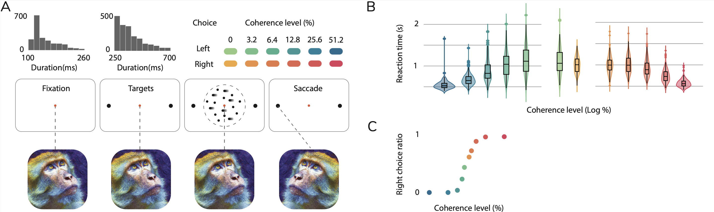

In our every day lives we are constantly bombarded with choices. Making a decision involves a deliberative process that results in the commitment to a categorical proposition. To commit to a choice we must take into account the amount and quality of evidence we have in favor or against available choices. We can gain insigths into this decision making process by understanding the neural underpinnings and correlates of how decisions are made. In this project, we model how neural networks are able to integrate and evaluate evidence to reach a decision in an experiment where monkeys perform a visual decision making task. The details of the task are described in Figure 1.

<figure>
    
    <figcaption>
  
 Figure 1. The reaction time dot motion direction discrimination task. (A) Experimental Design: The experimental protocol encompassed a four-stage task to investigate the neural mechanisms underlying decision-making in non-human primates. During the initial stage, the primate maintained fixation on a centrally presented dot, sustaining this fixation throughout the subsequent two stages. In the second stage, two opposing targets were simultaneously presented on the screen. The temporal duration of the first two stages was manipulated by the experimenter, guided by the distribution over trials shown on top for each stage. Following this, a masked circle comprising randomly moving dots was introduced, with a proportion of dots exhibiting a specific degree of coherence by moving in a consistent direction towards one of the targets on the screen. During this stage, the primate engaged in a deliberative process, taking into account the presented evidence, culminating in the execution of a saccadic eye movement towards the target deemed to be the destination of the coherent dots. (B) Distribution over trials of the monkey's reaction times, the time it takes the monkey to make a decision based on integrating evidence at various coherence levels. (C) Proportion of trials where the monkey chose the target on the right. It measures the error rates in the monkey's choices depending on the dot motion strength. 
   
    </figcaption>
</figure>

<iframe id="igraph" scrolling="no" style="border:none;" seamless="seamless" src="assets/images/TimeWarp3DPCAS6.html" height="800" width="100%"></iframe>

In this interactive figure we see how the population encodes the delibariont process as trajectories in neural state space of the average decision for different degrees of certainty and two choices (red and blue). To investigate the neural representation of the decision-making process at the population level, we initially characterized the trial-average activity for each of the 12 conditions. This analysis involves examining the aggregate activity patterns of neurons across multiple trials within each condition. To accommodate the inherent variability in the timing of neural activity relative to relevant behavioral events within each trial, we applied a time-warping transformation to the spiking activity. This transformation allowed us to align the neural activity across trials, facilitating a more accurate comparison and analysis of the spiking patterns associated with the decision-making process. The time warping effectively harmonizes the temporal coordination of task-related events across trials, facilitating a more precise and consistent analysis of the neural activity in relation to the task's behavioral stages, and enabling a direct and meaningful comparison across different conditions, as the neural signals are now on a unified and interpretable warped time scale. 

<iframe id="igraph" scrolling="no" style="border:none;" seamless="seamless" src="assets/images/LFADS-S6.html" height="800" width="100%"></iframe>

Next we characterize how the neural population encodes the decision-making process at the single trial level. The main challenge lies in accurately estimating the temporal changes in neural activity, given that it is heavily distorted by various sources of noise. We use a deep-learning approach to obtain the best guess for the neural activity. We use the LFADS model, specifically designed to capture the underlying dynamics and latent factors that govern the observed time-series data. It is often applied in the context of analyzing neural activity data, where the goal is to uncover the hidden factors that contribute to the observed neural responses. The LFADS model is based on a deep learning architecture that combines variational autoencoders with recurrent neural networks (RNNs). It can be used to infer the latent variables (hidden factors) that give rise to the observed data, denoise the data, and generate predictions for future time steps.

