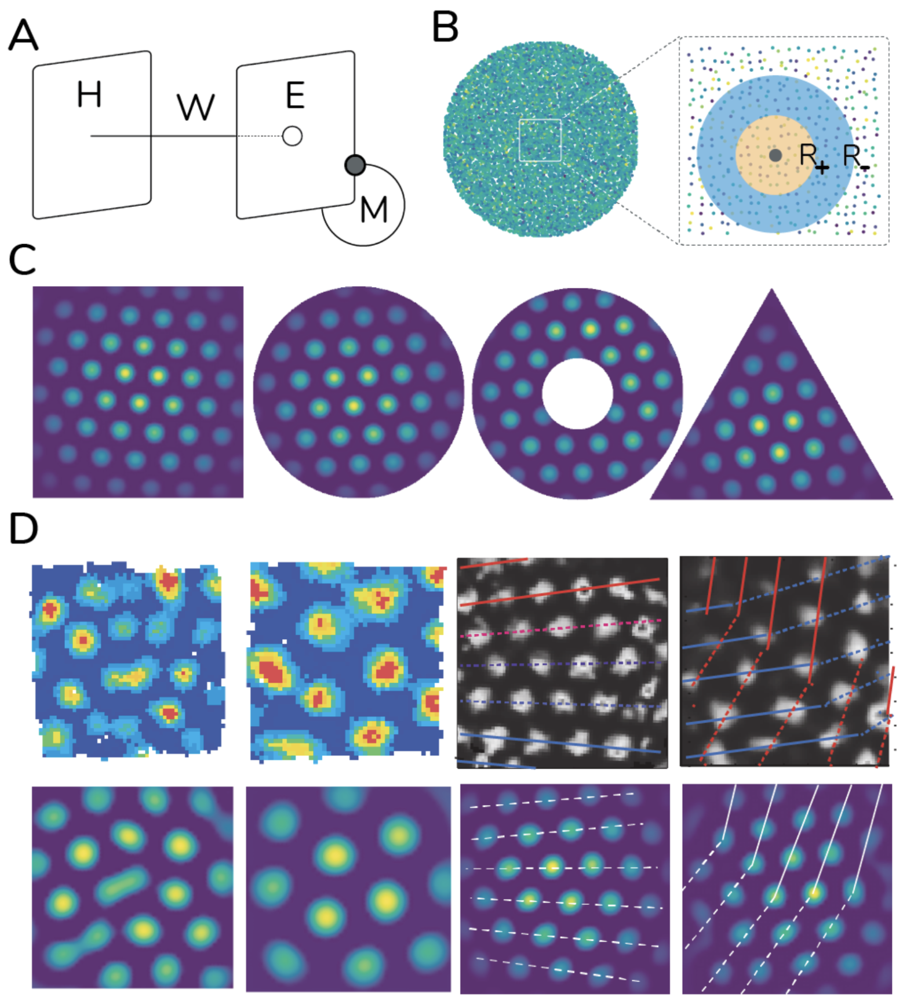
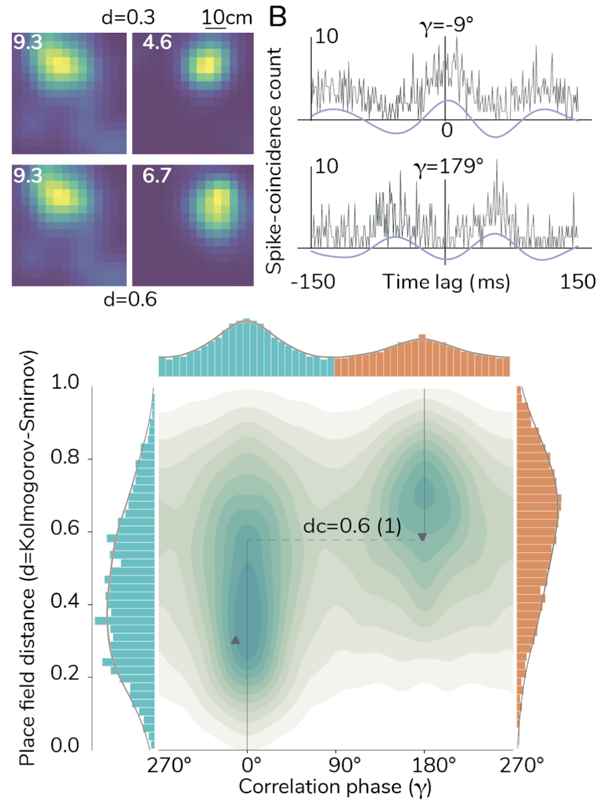

We developed a biologically plausible model explaining the formation of grid cells’ hexagonal patterns (Monsalve-Mercado & Leibold, 2017, 2020). The model is built upon a neural network framework whose architecture reflects existing axonal projections from hippocampal subfield CA1 into the medial Entorhinal cortex, where grid cells are found (Fig. 1A). Electrophysiological recordings of place cells in CA1 reveal an efficient strategy for the temporal encoding of spatial information. Termed phase precession, it allows cells to reproduce a sequence of overlapping place fields in timescales of a hundred milliseconds instead of behavioural timescales of the order of seconds (Dragoi & Buzsáki, 2006). 

<figure>
    
    <figcaption>
  Figure 1. Unsupervised learning of hexagonal spatial patterns by a biologically inspired convolutional neural network. 
(A) Neural network representation of a sub-system in the hippocampal formation. The input layer encodes rich spatial information and is modelled after the activity of place fields in hippocampal subfield CA1. The output layer represents cells in Layer II of Entorhinal cortex, and is modelled as a recurrent neural network with random and sparse connectivity. (B) Feedforward weights W inherit a one-to-one correspondence with physical space (here a circular enclosure). Biological details suggest weights are learned in an unsupervised way via a convolutional kernel of Mexican-hat shape. (C) Hexagonal patterns appear as a result of learning the weights. The recurrent connections are mathematically proven to ensure the appearance of the patterns in enclosures of any shape. (D) Patterns in nature exhibit certain geometrical deformations and defects  (top row). The model naturally reproduces these deformations without any additional assumptions (bottom row).
Adapted from Monsalve-Mercado & Leibold, 2020.
        
  </figcaption>
</figure>

A mathematical analysis of phase precession results in two interesting predictions for the encoding of two-dimensional space (Fig. 2, Monsalve-Mercado & Leibold, 2017). First, on behavioural timescales the spike-time cross-correlation of a pair of place cells should be approximately symmetric in the time domain when filtered in the theta band (8-12 Hz). As a result, the phase of the filtered signal at zero time-lag must be close to either 0° or 180°. Second, at the population level, these phases correlate with the distance between the place fields of the respective cell-pair, forming two clear clusters in the two-dimensional space spanned by phase and place field distance. In additional work (Monsalve‐Mercado & Roudi, 2020), these predictions were validated on hippocampal recordings of rats foraging in the open field.

<figure>
    
    <figcaption>
Figure 2. Theoretical predictions are validated on neural recordings: Spike-time correlations are mostly symmetric, and their phases correlate with place field distance. 
(A) Heatmaps of the location of spiking activity of place cells for a rat exploring a square box 20 minutes (place fields). Each row shows the distance d between a pair of place fields (d from 0 to 1, 1 means infinitely far away). (B) Spike-time cross-correlations for cell-pairs in A (grey trace). The signal is filtered in the theta-band (8-12 Hz, blue trace). (C) At the population level, simultaneous recordings of hundreds of cells reveal that correlations exhibit a high degree of symmetry in the theta band (±120 ms). As a result, their phases at zero time-lag cluster at around 0° and 180°, and moreover, they correlate with place field distance forming two robust clusters in two-dimensional phase-distance space. 
Adapted from Monsalve‐Mercado & Roudi, 2020.
        
  </figcaption>
</figure>

Why are these predictions important? A mathematical analysis of the network model suggests that this relationship is the key ingredient resulting in the development of grid cells’ hexagonal patterns. A simple unsupervised learning rule for the feedforward weights, based on simultaneous co-activation of input and output units (Hebbian learning), transforms the predicted relationship found in the input into a convolutional network with a filter kernel resembling a Mexican-hat shape (Fig. 1B). The weights are then shown to asymptotically self-organise into hexagonal patterns, reproducing the patterns in the output grid cell units. Mathematically, the network is equivalent to a Turing pattern formation process of strongly coupled systems, which reproduces in a simple framework most properties reported for grid cells as a population (Monsalve-Mercado & Leibold, 2020).
