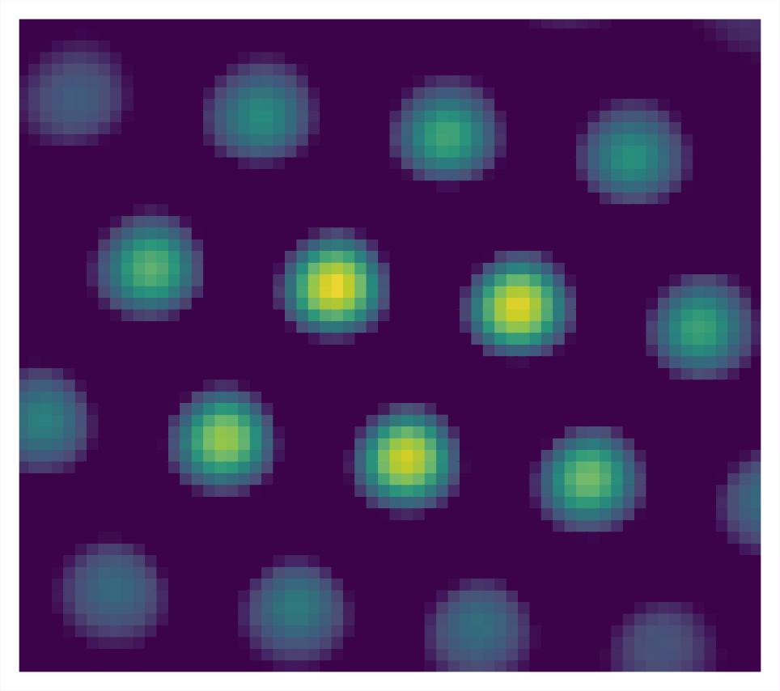

<!-- Main -->

<!-- On Computational Neuroscience -->
<section id="intro to compneuro">
	

		<header class="major">
			<h2>On Computational Neuroscience</h2>
		</header>
		
  

	

</section>

<!-- Two -->
<section id="two" class="spotlights">
	<section>
		
		

			

				<header class="major">
					<h3>How do we know where we are?</h3>
				</header>
				
Specialised cells in the mammalian hippocampal formation constitute the brain’s navigation system. The cells’ neural activity correlates with different aspects of the animal’s location and movements in space. Place cells, for instance, fire when the animal moves through a confined region of its environment (its place field). Different place cells fire for different regions, and together as a population they cover all of the environment. Grid cells, on the other hand, fire whenever the animal walks through the vertices of a hexagonal lattice that tessellates space. The system forms the neural substrate in the brain for self-positioning and path planning, motivating its focus as an exciting field of research. Key questions about the system are: How do these representations arise? What mechanistic properties of the system allow it to perform computations about space? What insights about brain function can we gain from its study? .

				<ul class="actions">
					<li><a href="gridcells.html" class="button">Learn more</a></li>
				</ul>
			

		

	</section>
	<section>
		
		

			

				<header class="major">
					<h3>What makes humans human?</h3>
				</header>
				
The cognitive abilities that characterize humans are thought to emerge from unique features of the cortical circuit architecture of the human brain, which include increased cortico–cortical connectivity. However, the evolutionary origin of these changes in connectivity and how they affected cortical circuit function and behaviour are currently unknown. In this work we explore the changes in the brain of a genetically modified mouse as a result of a human-specific gene that emerged in the ancestral genome of the Homo lineage before the major phase of increase in brain size. We use a computational model to understand the major changes in the humanized mouse's behaviour and increased performance in cognitive tasks. 

				<ul class="actions">
					<li><a href="humanmouse.pdf" class="button">Nature Paper</a></li>
				</ul>
			

		

	</section>
	<section>
		
		

			

				<header class="major">
					<h3>How do we make decisions?</h3>
				</header>
				
In our every day lives we are constantly bombarded with choices. Making a decision involves a deliberative process that results in the commitment to a categorical proposition. To commit to a choice we must take into account the amount and quality of evidence we have in favor or against available choices. We can gain insigths into this decision making process by understanding the neural underpinnings and correlates of how decisions are made. In this project, we model how neural networks are able to integrate and evaluate evidence to reach a decision in an experiment where monkeys perform a visual decision making task.     

				<ul class="actions">
					<li><a href="decision.html" class="button">Learn more</a></li>
				</ul>
			

		

	</section>
</section>

